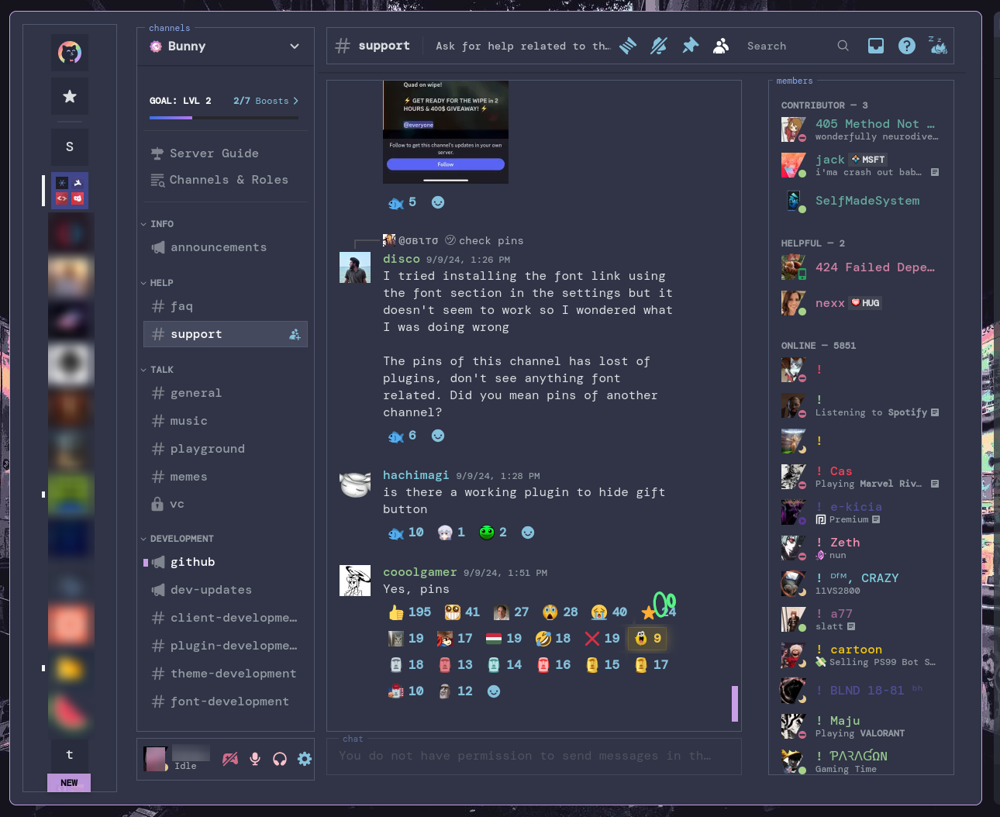

# Silenc3's Vencord Themes


A collection of minimalist, terminal-inspired themes for Vencord/Discord. Currently featuring the **Catppuccin Diskette** theme.



## Features
- Catppuccin Frappe color scheme
- Terminal-style monospace fonts
- Minimalist bordered UI elements
- Custom ASCII-inspired headers
- Streamer mode enhancements
- Integrated Catppuccin branding

## Installation
1. Open Discord User Settings
2. Navigate to Vencord → Themes
3. Enable "Enable Custom Themes"
4. Add this URL to Online Themes:
   ```css
   https://raw.githubusercontent.com/Silenc3IsGold3n/vencord-themes/refs/heads/main/frappe-diskette.css
   ```

## Contributing
PRs welcome! Please adhere to:
- Catppuccin color palette guidelines
- WTFPL license terms
- Maintain terminal aesthetic

## License
```text
DO WHAT THE FUCK YOU WANT TO PUBLIC LICENSE
Version 2, December 2004
```
Full text in [LICENSE](LICENSE) file